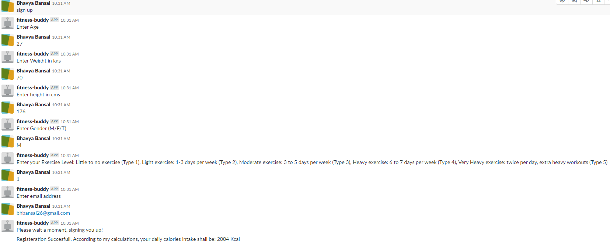
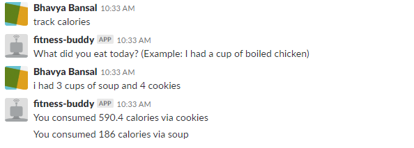
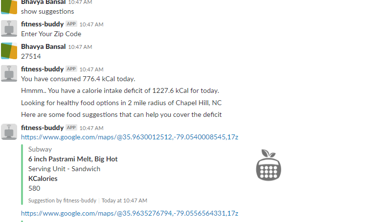
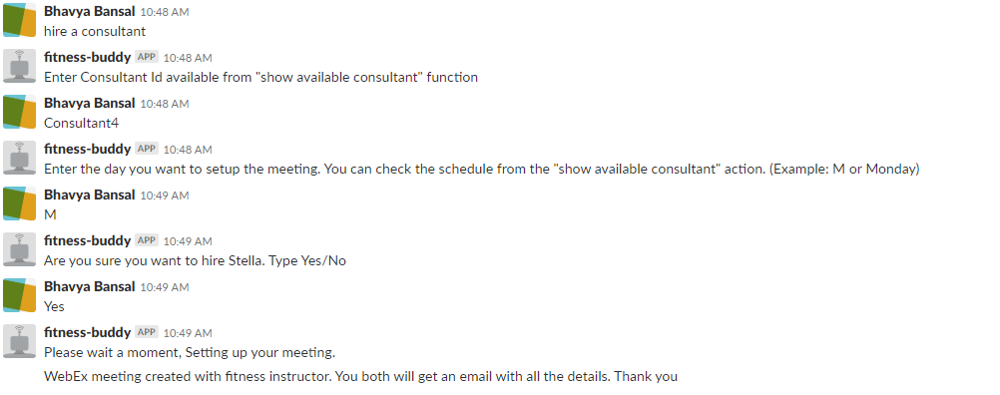
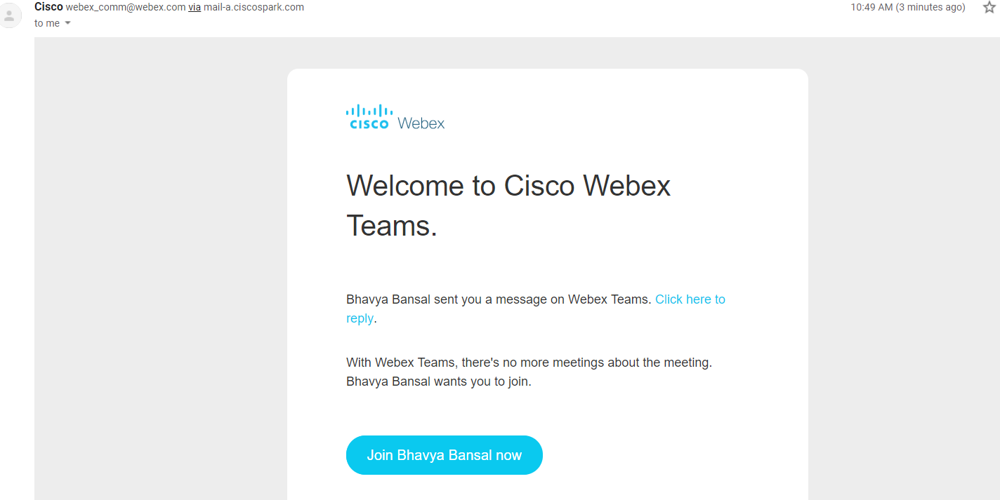

# FitnessBuddy
# Hackathon project for HackNc

## Inspiration
12.7 million: That's the number of American kids who fall under the category of being obese. We wanted to transform the fitness industry and hence we came up with the idea of Fitness Buddy: your personal fitness assistant.

## What it does
1. **Sign-up**: It is integrated with calorie goal finder that calculates the ideal daily calorie intake for the user based on the user’s BMR.
2. **Food calorie tracker**: Here user describes the food he ate, and our slackbot uses NLP to parse the input and returns the amount of calories consumed in each food item. We used Nutritionix Nutrients API.
3. **Exercise tracker**: Here user describes the exercise he did, and our slackbot uses NLP to parse the input and returns the amount of calories burnt in participating in the exercise. We used Nutritionix Exercise API.
4. **Progress tracker**: This feature informs a user about the overall calories he has consumed so far. This enables him to track his progress towards his fitness goals.
5. **Food/Restaurant Suggestions**: This feature checks how many calories the user still needs to consume for the day and accordingly suggests food items and restaurants near him that have those food items. We used Zipcode API and Nutritionix Search API.
6. **Show available consultants**: This feature allows a user to see the health and fitness consultants available, and their available slots and specialization.
7. **Hire a consultant**: After viewing the available consultants, this feature allows the user to hire a consultant for personal training/consultation. We used Cisco Webex API here/

## How we built it
Our chat-bot runs on a Node.js server.
We used the Slack UI to act as the front-end for our application and the primary interaction console.
We used MongoDB to maintain and store user information.
API.ai was used to provide NLP capabilities to the slack bot.
Calorie consumption during Exercise and Calorie intake while eating food were measured using the Nutritionix API.
Cisco Webex API was used to schedule meetings with consultants and the ZipCode API to get user location.

## Challenges we ran into
1. Not all group members were well versed with Nodejs and MongoDB, so we had to learn hard and fast, and had to debug way a lot of code for trivial issues.
2. Apparently MongoDB doesn't update its documentation frequently, so we had to go through multiple open issues on GitHub to figure out the correct syntax for newer versions of MongoDB.
3. We had to integrate a total of 4 API, each with their unique app keys and authentication systems. We had to plan a lot and distribute the work so that we could work parallely.

## Accomplishments that we're proud of
1. We designed a working Fitness bot in a span of 24 hours.
2. Integration and use of multiple REST APIs.
3. We were able to facilitate room sharing and scheduling of appointments "in realtime" with health instructors using Webex API!

## What we learned
1. We learnt how to use and integrate API.ai.
2. We learnt how to build applications in Node.js, especially bots for Slack.

## What's next for Fitness Buddy
1. Food Suggestions can be more specific based on amount of proteins /carbohydrates / fats consumed so far.
2. Payment integration while hiring a consultant.
3. Development of UI as a web/native application to increase the customer base.
4. Use of multi-factor authentication.
5. Use of Machine Learning to analyse the data of a user over time and predict useful tips for the user.

## Gallery

### Help and Introduction

### Sign Up

### Calorie Tracking with Food Consumption

### Calories Burned with Exercise Tracking

### Food Suggestions based on Calorie Deficit

### Available Health Consultants

### Schedule Meeting with Consultant

### Cisco Webex Invite

### Email Invite

